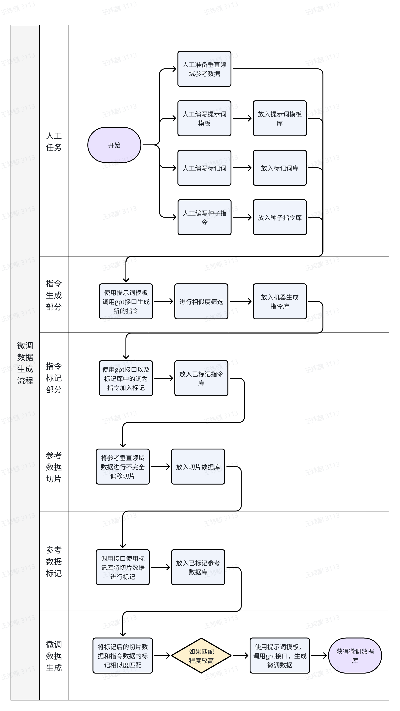

使用步骤分为6步
1. 安装依赖
2. 准备好存放数据的jsonl文件，以及参考数据、标记数据
3. 配置.env文件
4. 首先生成slice和instruction数据，运行slice_generation.py和instruction_generation.py，其中生成slice的数据源为参考数据文件夹，其中的所有docx文件都将被读取
5. 之后运行data_label.py，分别为slice和instruction生成标注并存放
6. 最后使用fineturning_generation.py生成微调数据
7. 生成数据图片如下所示flow_chart.png
